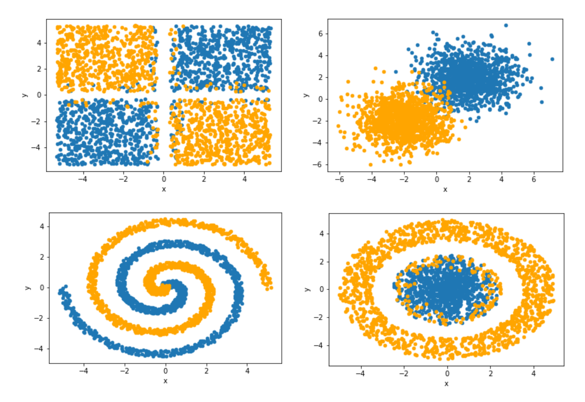

# Multi-Layer Perceptron (MLP) Neural Network from Scratch

## Overview

This project focuses on building a Multi-Layer Perceptron (MLP) neural network from scratch using only NumPy and Pandas. The MLP neural network is a fundamental architecture used in deep learning for various tasks, including classification and regression. By implementing the neural network from scratch, participants will gain a deeper understanding of its inner workings and how it processes data. The implementation will be trained and tested on four datasets inspired by the TensorFlow Neural Network Playground.

## Project Plan

1. **Implementing the MLP Neural Network:** The project will involve building the MLP neural network architecture, including defining the number of layers, activation functions, loss functions, and optimization algorithms.

2. **Data Preprocessing:** Participants will preprocess the datasets, handling missing values, normalizing the features, and splitting them into training and testing sets.

3. **Training the Neural Network:** The neural network implementation will be trained on the preprocessed datasets using backpropagation and stochastic gradient descent (SGD).

4. **Evaluating the Neural Network:** After training, the neural network's performance will be evaluated on the testing datasets, measuring metrics such as accuracy or mean squared error.

## What I've Learned

Through the development of the MLP neural network from scratch and its training and testing on four datasets, participants will gain practical experience and knowledge in the following areas:

1. **Neural Network Architecture:** Students will understand the structure and components of a multi-layer perceptron (MLP) neural network.

2. **Data Preprocessing:** The project will cover essential data preprocessing techniques, including feature normalization and data splitting.

3. **Forward and Backward Propagation:** Participants will learn how forward and backward propagation work in training neural networks.

4. **Activation Functions and Loss Functions:** Students will explore different activation functions and loss functions used in neural networks and their effects on training.

5. **Optimization Algorithms:** The course will cover optimization algorithms, such as stochastic gradient descent (SGD), for updating neural network parameters during training.
